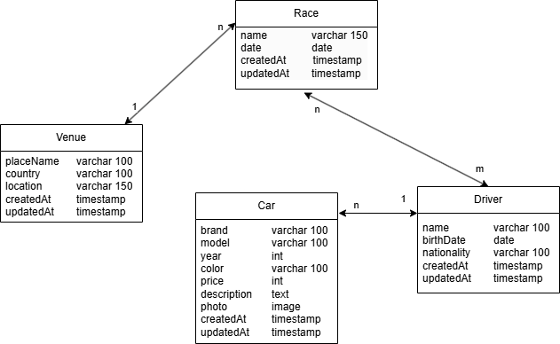

This repository has a little example of DJANGO usage, using django rest framework. It consists on a rally API that has its own vite-react frontend. The purpouse of this project is academic, to learn how to use Django and to explore its estructure at usage, using a really interesting topic that i am passionate about: Rally. The information into the api may not be historically accurate.
_____________________________________

Technologies and software:
- *Backend*:
  - Django 5.1.7
  - Django rest framework 3.15.2
  - Python 3.13

- *Frontend*:
  - Vite 6.2.0
  - React 19.0.0
  - Tailwindcss 4.0.14
  - Eslint 9.21
  - dotenv 16.4.7

______________________

Data model:

_____

[Juan Camilo Cárdenas Zabala](https://www.linkedin.com/in/juan-camilo-c%C3%A1rdenas-zabala-5aa65b309/)
Software Developer
